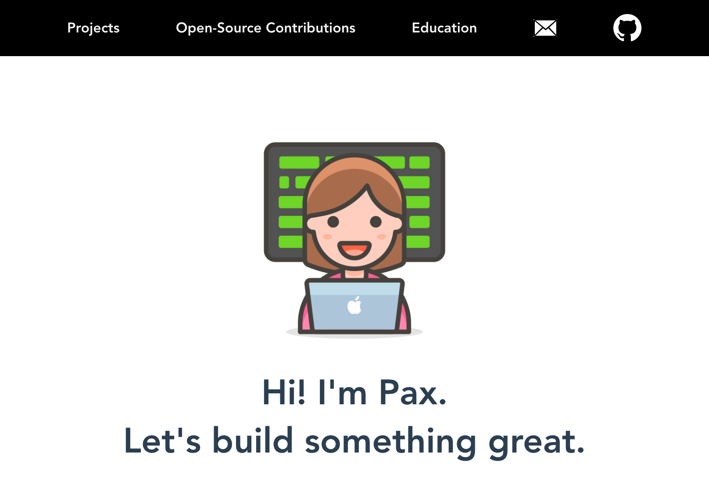

# Pax's Portfolio (Frontend)

<p align="center">
    <a href="https://app.netlify.com/sites/laughing-brattain-d0abbd/deploys">
        
    </a>
    <a href="https://app.buddy.works/paxmargret/portfolio-api/pipelines/pipeline/318477">
        
    </a>
</p>

<p align="center"><em>Over-engineering my portfolio for hands-on learning experience! Deployed in AWS; Set up CI/CD using <a href="https://buddy.works/">buddy.works</a></em></p>

<p align="center">
    
</p>

<p align="center">Backend API Github Repository: <a href="https://github.com/paxcodes/portfolio_api">paxcodes/portfolio_api</a></p>


## Concepts Implemented

- Functional components
- Slots, Named Slots, with parameters

## Project setup
```
npm install
```

### Compiles and hot-reloads for development
```
npm run serve
```

### Compiles and minifies for production
```
npm run build
```

### Lints and fixes files
```
npm run lint
```

### Customize configuration
See [Configuration Reference](https://cli.vuejs.org/config/).
